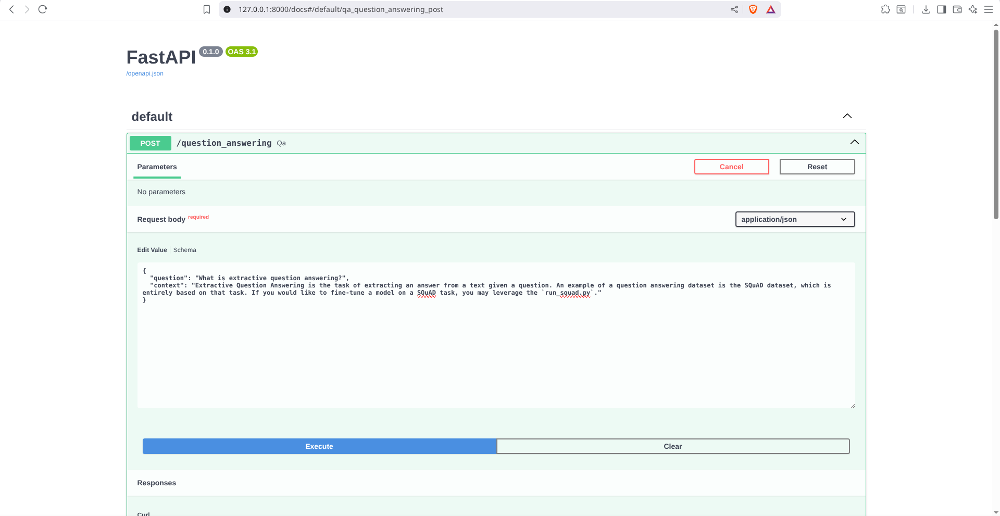
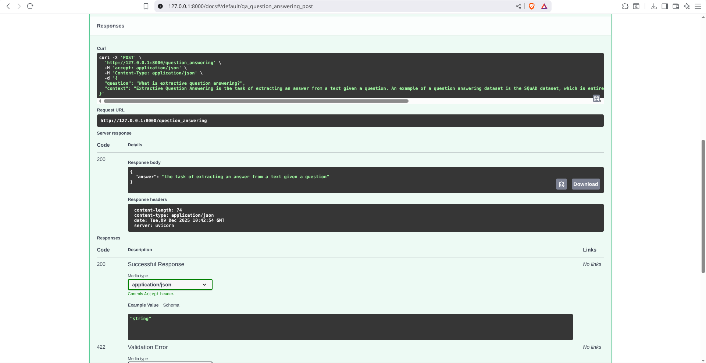
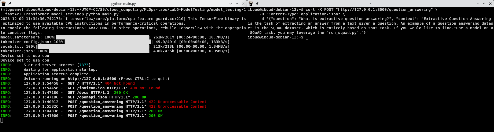
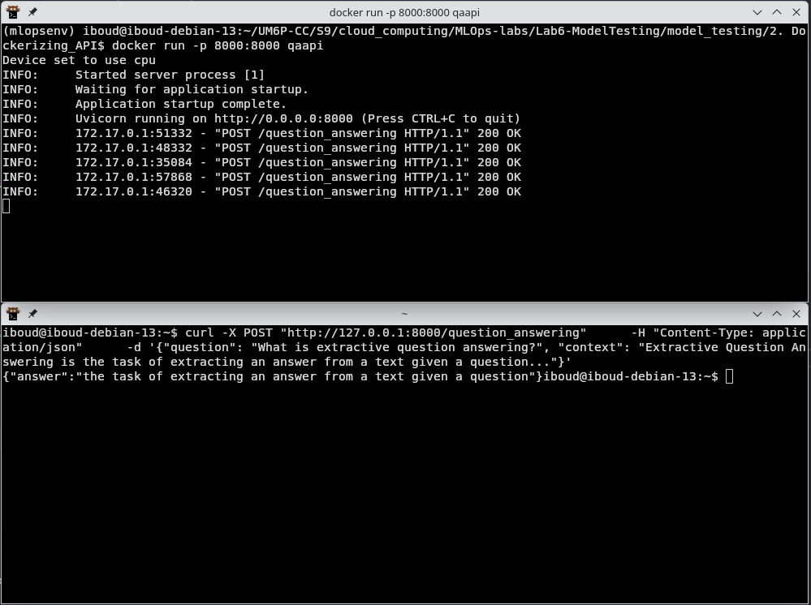
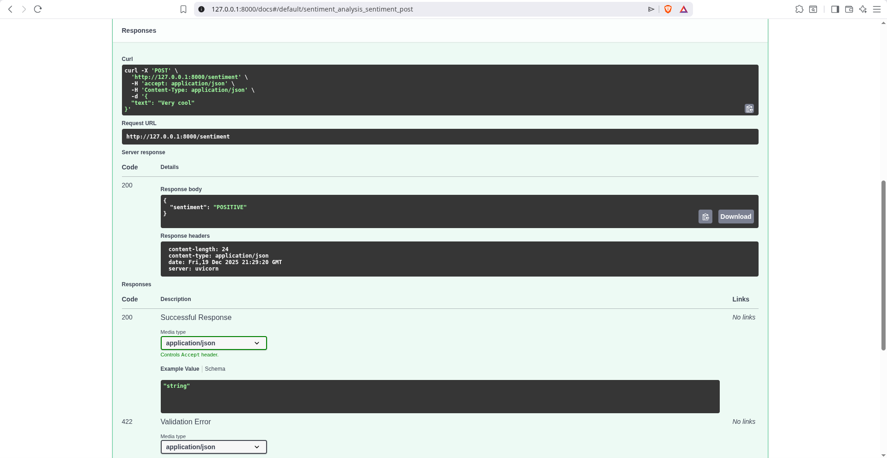
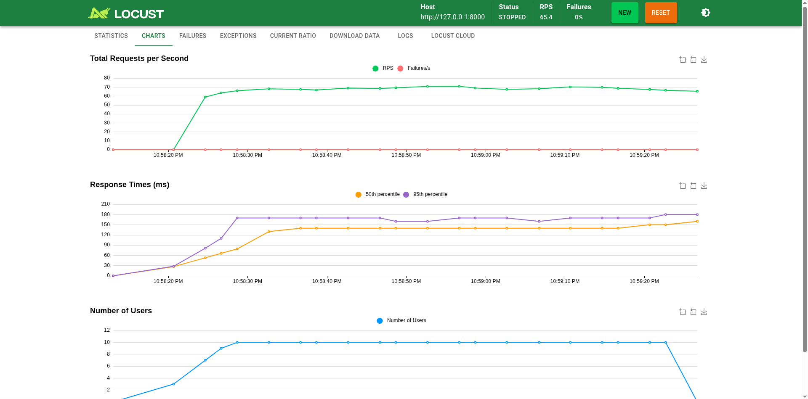
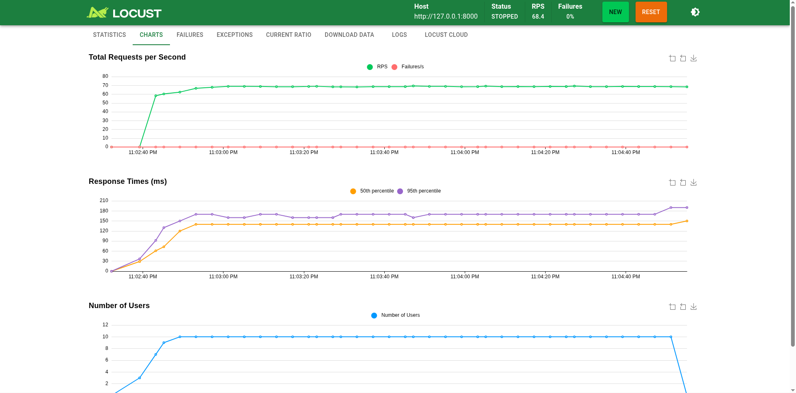
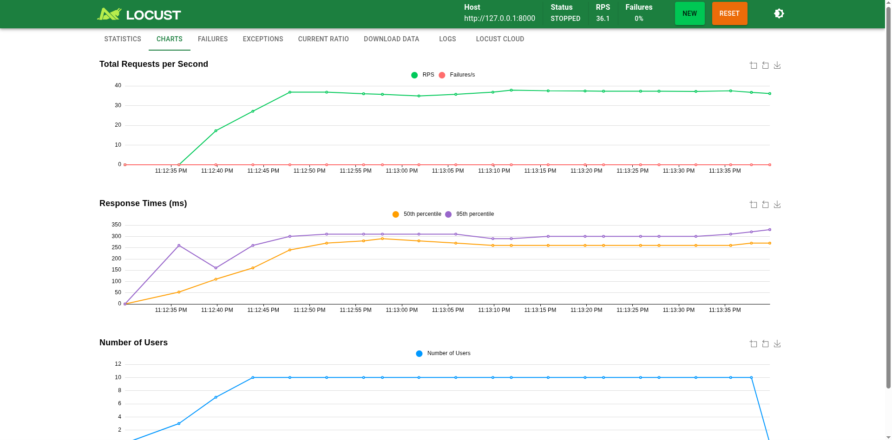

# Lab Report: Model Testing

## Overview

The objective of this lab is to test the performance of various deployment strategies for machine learning models. Specifically, we focus on:

- Deployment using **FastAPI**.
- Containerization using **Docker**.
- Model serving using **TensorFlow Extended (TFX)**.

---

## 1. Serving a NLP Model using FastAPI

**Objective:** Deploy a Question Answering (QA) model using `FastAPI` and HuggingFace's `distilbert-base-cased-distilled-squad`.

**Implementation:**

- Created a `QADataModel` using Pydantic for input validation.
- Initialized the asynchronous `/question_answering` endpoint.
- Loaded the pipeline using the `transformers` library.
- Served the API using `uvicorn`.

**Testing & Results:**
The API was tested via the Swagger UI (`http://127.0.0.1:8000/docs`). The input JSON was formatted to remove line breaks to ensure valid parsing.

_Figure 1: API Input Configuration_


_Figure 2: JSON Response_


**Conclusion:**
The model successfully extracted the correct answer from the context, validating the FastAPI deployment.

### 1.1 Alternative Testing via cURL

**Objective:** Verify the endpoint using the command line (`curl`) as a lightweight alternative to the Postman GUI.

**Implementation:**
We executed a `POST` request directly from the terminal. The JSON payload was flattened to a single line to avoid parsing errors associated with multi-line strings in shell commands.

```bash
curl -X POST "http://127.0.0.1:8000/question_answering" \
     -H "Content-Type: application/json" \
     -d '{"question": "What is extractive question answering?", "context": "Extractive Question Answering is the task of extracting an answer from a text given a question..."}'
```

**Results:**
The server successfully returned the JSON response containing the extracted answer, confirming the API functions correctly without requiring a graphical interface.

_Figure 3: cURL Command Output_


---

## 2. API Containerization using Docker

**Objective:** Isolate the FastAPI service into a Docker container to ensure environment consistency and portable deployment.

**Implementation:**

- The project was restructured by moving `main.py` to an `/app` directory.
- There's also a `Dockerfile` to install dependencies (`torch`, `fastapi`, `uvicorn`, `transformers`).
- Built the image: `docker build -t qaapi .`.
- Launched the container: `docker run -p 8000:8000 qaapi`.

**Testing & Results:**
The containerized API was verified using a `curl` request to the mapped port 8000. The service remained functional, providing the same NLP extraction capabilities as the native deployment.

_Figure 4: Containerized API Test via cURL_


**Conclusion:**
Docker successfully encapsulated the application and its dependencies, proving the model can be served reliably in a controlled environment.

---

## 3. Model Serving using TensorFlow Extended (TFX)

**Objective:** Deploy the model using TFX for high-performance serving and use a FastAPI wrapper to handle request preprocessing.

**Implementation:**

1. **Model Preparation:** Generated a `SavedModel` using the provided notebook and prepared a custom TFX image:
   ```bash
   docker pull tensorflow/serving
   docker run -d --name serving_base tensorflow/serving
   docker cp tfx_model/saved_model serving_base:/models/bert
   docker commit --change "ENV MODEL_NAME bert" serving_base my_bert_model
   ```
2. **Serving:** Started the TFX container exposing the REST API (port 8501) and gRPC (port 8500):
   ```bash
   docker run -p 8501:8501 -p 8500:8500 --name bert my_bert_model
   ```
3. **FastAPI Wrapper:** Created a service to act as an intermediary. Unlike the integrated model in Part 1, this `main.py` acts as a client that tokenizes input text and forwards it to the TFX backend.

**Observations:**

- TFX cannot handle raw strings directly. The FastAPI wrapper is necessary to tokenize text into the specific input format (tensors) required by the BERT model before calling the TFX REST endpoint.
- This separation allows the heavy lifting (inference) to be handled by a dedicated TFX server while FastAPI manages the API logic and preprocessing.

**Testing & Results:**
The service was tested at `http://127.0.0.1:8000/sentiment`. The FastAPI service successfully communicated with the TFX container to return sentiment predictions.

_Figure 5: TFX-backed FastAPI Response_


**Conclusion:**
Serving via TFX provides a production-grade environment. By decoupling preprocessing (FastAPI) from inference (TFX), the deployment becomes more scalable and efficient.

---

## 4. Load Testing & Performance Benchmarking

**Objective:** Quantify the throughput (RPS) and latency (RT) of all three deployment strategies under a simulated load of 10 concurrent users.

### 4.1 Comparative Analysis

I executed load tests using **Locust** for each architecture. Note: Models 1 & 2 utilize **DistilBERT** (lightweight), while Model 3 utilizes a full **BERT** architecture via TFX, explaining the performance delta.

| Deployment Strategy    | RPS (Requests/Sec) | Average RT (ms) |
| :--------------------- | :----------------- | :-------------- |
| **FastAPI (Native)**   | 65.4               | 135.87          |
| **Dockerized FastAPI** | 68.4               | 141.67          |
| **TFX-based FastAPI**  | 36.1               | 258.73          |

### 4.2 Visual Benchmarks (Locust Dashboards)

_Figure 6: Native FastAPI Performance_


_Figure 7: Dockerized FastAPI Performance_


_Figure 8: TFX + FastAPI Performance_


### 4.3 Technical Synthesis & PDF Q&A

**1. How were the tests conducted?**
Isolated each service and targeted the corresponding endpoint (`/question_answering` for Parts 1-2, `/sentiment` for Part 3) using a tailored `locust_file.py` payload.

**2. Why the performance variance?**

- **Native vs. Docker:** The performance is nearly identical. Modern Docker networking overhead is negligible, proving containerization provides isolation without sacrificing significant speed.
- **TFX Performance:** Counter-intuitively, the TFX deployment showed lower RPS. This is attributed to the **architectural trade-off**: Model 3 uses a standard BERT model (higher parameter count) compared to the optimized DistilBERT used in Parts 1 and 2. Additionally, the FastAPI-to-TFX REST communication introduces serialization overhead.

**3. Which is the best deployment?**
For **latency-sensitive** applications with smaller models, **Dockerized FastAPI** is optimal. For **production-scale** systems requiring model versioning and hardware acceleration (GPU), **TFX** is the industry standard despite the overhead observed in this local CPU-bound test.

---

**Lab Complete.**
